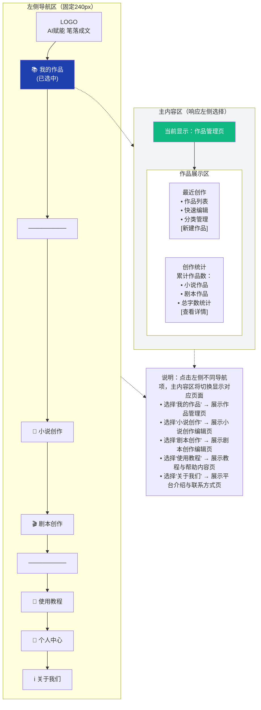

# JUGO（AI小说剧本创作平台）前端设计方案稿

突出“双场景适配、长文本友好、AI全流程赋能”的前端体验，适配10万+字长文本创作与剧本专业格式编辑，满足新手快速上手、专业用户高效创作的双重需求。

## 设计总则

### 设计理念

轻量操作，重度赋能——前端布局简洁有序，核心功能一键可达，弱化技术门槛；同时将AI辅助、格式编辑、长文本管理等核心功能可视化、便捷化，减少创作干扰，聚焦内容本身；兼顾小说创作的流畅性与剧本创作的专业性，实现双场景无缝切换。

### 核心目标

- 新手适配：操作路径≤3步触达核心创作，引导式输入降低入门门槛；

- 效率提升：AI功能（续写、润色、转换、大纲生成）一键调用，长文本分章管理、上下文实时同步；

- 双场景适配：明确区分小说/剧本编辑模式，剧本模式支持专业格式（场景、角色、台词），小说模式支持长文本优化；

- 体验一致：多端同步（PC/平板/手机），交互逻辑统一，避免用户学习成本（参考蛙蛙多端适配特性）；

- 差异化突出：强化小说↔剧本双向转换可视化、雪花写作法引导、长文本审校提示，填补竞品前端空白。

### 目标用户

- 核心用户：网文新手、短剧创作者、兼职编剧（追求高效、简易操作）；

- 次要用户：专业编剧、长篇小说作者（需要专业格式、上下文管理）；

- 潜在用户：内容创业者、自媒体人（需要多场景内容生成、快速导出）。

## 核心设计规范（统一视觉与交互，贴合商业产品质感）

### 色彩规范（贴合创作氛围，简洁不刺眼）

- 主色调：墨蓝色（#1E40AF）—— 贴合文字创作的沉稳氛围，区别于竞品的亮色，提升专业感；

- 辅助色：
        
    - 功能色：绿色（#10B981，用于确认、生成、保存按钮）、橙色（#F59E0B，用于提示、引导、AI功能入口）、红色（#EF4444，用于删除、取消按钮）；

    - 中性色：白色（#FFFFFF，编辑区背景）、浅灰（#F3F4F6，页面背景）、中灰（#9CA3AF，辅助文字）、深灰（#1F2937，正文文字）；

- 色彩禁忌：避免高饱和对比色，编辑区背景与文字对比度≥4.5:1，保障长时间创作不疲劳。

### 字体规范（适配小说阅读与剧本编辑）

- 中文主字体：微软雅黑、思源黑体（无衬线字体，清晰易读，适配多设备）；

- 剧本专用字体：Courier New（等宽字体，符合剧本行业规范，角色名、台词对齐整齐）；

- 字体层级：
        

    - 页面标题：18-22px，加粗，深灰（#1F2937）；

    - 功能标题：16px，加粗，主色调（#1E40AF）；

    - 正文文字（小说）：14-16px，常规，深灰（#1F2937），行高1.8；

    - 剧本文字：12-14px，常规，深灰（#1F2937），行高1.6（等宽字体）；

    - 辅助文字：12px，常规，中灰（#9CA3AF）；

### 组件规范（统一交互，降低学习成本）

- 按钮：圆角4px，hover状态亮度提升10%，点击状态亮度降低10%；核心功能按钮（生成、导出）加大尺寸，置于显眼位置（参考笔灵AI核心功能突出设计）；

- 输入框：圆角4px，边框浅灰（#D1D5DB），focus状态边框主色调（#1E40AF），提示文字中灰（#9CA3AF）；

- 弹窗：圆角8px，阴影柔和（rgba(0,0,0,0.1)），标题加粗16px，内容区14px，底部按钮对齐右侧；

- 标签：圆角2px，背景浅灰（#F3F4F6），文字中灰（#9CA3AF），适配题材、风格等标签展示；

- 进度条：高度4px，背景浅灰（#D1D5DB），进度色主色调（#1E40AF），用于AI生成、导出等进度展示。

### 交互规范（流畅高效，反馈及时）

- 即时反馈：AI生成、保存、导出等操作，显示进度条+文字提示（如“生成中30%”“保存成功”），避免用户重复操作；

- 快捷操作：编辑区选中文字，右键唤起快捷菜单（续写、润色、删除、格式调整）；

- 无感知同步：创作过程中自动实时保存（每30秒一次），显示“自动保存中”提示，避免内容丢失；

- 场景切换：小说/剧本模式切换时，提示“格式将自动适配，不会丢失内容”，切换后保留编辑进度。

## 页面架构设计

### 页面交互说明

主内容区为动态响应区域，根据用户在左侧导航区的选择实时切换页面内容：
- 选择"我的作品" → 主内容区展示作品管理页
- 选择"小说创作" → 主内容区展示小说创作编辑页
- 选择"剧本创作" → 主内容区展示剧本创作编辑页
- 选择"使用教程" → 主内容区展示教程与帮助内容页
- 选择"关于我们" → 主内容区展示平台介绍与联系方式页

### 页面布局示意图

- 当用户选择"我的作品"时:



## 核心页面详细设计

### 作品管理页

#### 页面定位
作品管理页是用户进入平台后的首页，承担作品展示、分类管理、快速创建、数据统计等核心功能，需要让用户快速找到历史作品并开始新创作。

#### 布局结构（PC端）

**顶部操作区（高度60px）**
- 左侧：页面标题"我的作品"（18px加粗）+ 作品总数统计（如"共32部作品"）
- 右侧：[新建小说] [新建剧本] 两个核心按钮（绿色#10B981，圆角4px，高度40px）

**筛选与搜索区（高度80px）**
- 左侧：分类筛选标签（全部/小说/剧本/草稿/已完成），点击切换，选中状态背景主色调#1E40AF
- 中间：排序方式下拉框（最近编辑/创建时间/字数/标题），默认"最近编辑"
- 右侧：搜索框（宽度300px，支持按标题/内容搜索，实时过滤）

**作品列表区（主体区域，可滚动）**
- 卡片式布局，每行3-4个作品卡片（响应式调整）
- 单个作品卡片内容：
  - 顶部：作品封面图（默认提供模板，支持自定义上传，尺寸16:9）
  - 中部：作品标题（16px加粗，最多显示2行，超出省略）+ 类型标签（小说/剧本，圆角2px）
  - 底部左侧：字数统计（如"12.5万字"）+ 最后编辑时间（如"2小时前"）
  - 底部右侧：快捷操作按钮（[继续编辑] [导出] [删除]，hover显示）
- 空状态提示：无作品时显示引导图+文案"开始你的第一部作品"+ [新建作品]按钮

**右侧统计面板（宽度280px，固定）**
- 创作统计卡片：
  - 累计作品数（大号数字+图标）
  - 小说作品数 / 剧本作品数（分类统计）
  - 总字数统计（如"累计创作50万字"）
  - 本周创作字数（进度条展示，激励用户持续创作）
- 快捷功能卡片：
  - [导入作品]（支持txt/docx格式）
  - [回收站]（查看已删除作品，30天内可恢复）
  - [导出全部]（批量导出所有作品）

#### 交互逻辑
- 点击作品卡片任意位置 → 进入对应编辑页（小说/剧本）
- 点击[新建小说]/[新建剧本] → 弹窗输入作品标题+题材标签 → 创建成功后跳转编辑页
- 点击[删除] → 二次确认弹窗"确认删除《作品名》？删除后可在回收站恢复" → 确认后移入回收站
- 搜索框输入 → 实时过滤作品列表，无结果时显示"未找到相关作品"
- 作品卡片hover → 显示快捷操作按钮，提升操作效率

#### 响应式适配
- 平板端：作品卡片每行2个，右侧统计面板折叠为顶部横向展示
- 手机端：作品卡片单列展示，统计面板折叠为可展开抽屉，搜索框宽度100%

---

### 小说创作编辑页

#### 页面定位
小说创作编辑页是核心创作场景，需要支持长文本编辑（10万+字）、分章管理、AI辅助创作、实时预览等功能，兼顾流畅性与专业性。

#### 布局结构（PC端三栏布局）

**左侧设置区（宽度280px，可折叠）**

*基础信息模块*
- 作品标题输入框（可编辑，自动保存）
- 题材标签选择（如"都市/玄幻/言情"，多选，最多3个）
- 风格标签选择（如"轻松/热血/悬疑"，多选，最多3个）
- 字数统计（实时更新，如"当前12.5万字"）

*章节管理模块*
- 章节列表（树形结构，支持拖拽排序）
  - 显示章节标题+字数（如"第一章 开端 3200字"）
  - 点击章节 → 编辑区跳转到对应章节
  - 右键菜单：[重命名] [删除] [插入新章节] [合并章节]
- 底部按钮：[新建章节] [批量管理]

*AI辅助模块*
- [大纲生成]：基于当前内容生成后续大纲
- [角色管理]：添加/编辑角色信息（姓名/性格/关系），AI自动提取
- [灵感库]：保存创作灵感片段，随时调用

*雪花写作法引导（可选展开）*
- 步骤1：核心概括（一句话概括故事）
- 步骤2：扩展大纲（三幕结构）
- 步骤3：角色设定（主要角色卡片）
- 步骤4：正文创作（跳转编辑区）
- 进度条显示当前完成步骤

**中间编辑区（主体区域，最大化）**

*顶部工具栏（高度50px）*
- 左侧：格式工具（加粗/斜体/下划线/标题/引用/列表）
- 中间：AI快捷功能（[续写] [润色] [扩写] [改写]，橙色#F59E0B）
- 右侧：[保存]（绿色） [导出]（蓝色） [预览]（灰色）
- 自动保存提示（右上角，显示"已保存"或"保存中..."）

*编辑区主体*
- 富文本编辑器（支持markdown快捷输入）
- 行号显示（左侧，便于定位）
- 字数统计（底部状态栏，实时更新"当前章节2300字"）
- 选中文字 → 右键快捷菜单（[续写] [润色] [删除] [复制] [AI改写]）
- 长文本优化：分段加载，滚动到底部自动加载下一章节
- 专注模式：点击[专注]按钮，隐藏左右侧栏，编辑区全屏

*AI生成提示区（编辑区底部，可展开）*
- 显示AI生成进度（如"AI续写中...30%"）
- 生成完成后显示内容预览，用户可选择[接受] [重新生成] [编辑后接受]

**右侧预览区（宽度320px，可折叠）**

*实时预览模块*
- 显示当前章节的阅读效果（模拟小说阅读器样式）
- 字体/行距可调节，便于查看排版效果
- 底部按钮：[全屏预览] [导出预览]

*问题提示模块*
- AI自动检测内容问题（如"第3章出现角色名不一致""第5章情节与第2章矛盾"）
- 点击问题 → 编辑区跳转到对应位置，高亮显示
- 问题类型：逻辑矛盾/角色错误/语法错误/重复内容

*创作建议模块*
- 根据当前内容，AI提供创作建议（如"可以增加角色冲突""节奏偏慢，建议加快"）
- 点击建议 → 展开详细说明+参考案例

#### 核心交互逻辑

*AI续写流程*
1. 用户点击[续写]按钮或选中文字后右键选择[续写]
2. 弹窗选择续写方式（智能续写/按大纲续写/自定义提示词）
3. 显示生成进度条+预计时间（如"生成中...预计30秒"）
4. 生成完成后，内容插入编辑区，高亮显示，用户可编辑或删除
5. 右侧预览区同步更新

*章节切换流程*
1. 左侧章节列表点击章节 → 编辑区平滑滚动到对应章节
2. 编辑区滚动 → 左侧章节列表自动高亮当前章节
3. 切换章节时，自动保存当前章节内容

*导出流程*
1. 点击[导出]按钮 → 弹窗选择导出格式（txt/docx/pdf/epub）
2. 选择导出范围（全部章节/选中章节/当前章节）
3. 显示导出进度条 → 完成后自动下载文件

#### 响应式适配
- 平板端：左侧设置区与右侧预览区合并为可切换标签页，编辑区占据主体
- 手机端：单栏布局，编辑区全屏，工具栏简化为核心功能，章节管理/预览通过底部标签切换

---

### 剧本创作编辑页

#### 页面定位
剧本创作编辑页需要支持专业剧本格式（场景/角色/台词/动作），符合行业规范，同时提供AI辅助分镜、角色对话生成等功能。

#### 布局结构（PC端三栏布局）

**左侧设置区（宽度280px，可折叠）**

*基础信息模块*
- 剧本标题输入框
- 类型标签（短剧/电影/话剧/网剧）
- 时长预估（根据剧本内容自动计算，如"预计时长45分钟"）
- 场景数统计（如"共15个场景"）

*场景管理模块*
- 场景列表（树形结构，支持拖拽排序）
  - 显示场景编号+场景名（如"场景1：咖啡厅-白天-内景"）
  - 点击场景 → 编辑区跳转到对应场景
  - 右键菜单：[重命名] [删除] [插入新场景] [复制场景]
- 底部按钮：[新建场景] [场景模板库]（提供常见场景模板）

*角色管理模块*
- 角色列表（显示角色名+出场次数）
- 点击角色 → 显示角色详情（性格/关系/台词统计）
- 底部按钮：[添加角色] [角色关系图]（可视化展示角色关系）

*AI辅助模块*
- [分镜生成]：基于剧本内容生成分镜脚本
- [对话优化]：优化角色对话，使其更符合角色性格
- [冲突建议]：AI分析剧本冲突点，提供增强建议

**中间编辑区（主体区域，专业剧本格式）**

*顶部工具栏（高度50px）*
- 左侧：剧本格式工具（[场景] [角色] [台词] [动作] [旁白]，快捷插入）
- 中间：AI快捷功能（[续写对话] [生成动作] [场景描述]）
- 右侧：[保存] [导出] [预览]

*编辑区主体（等宽字体Courier New）*
- 剧本格式示例：
  ```
  场景1：咖啡厅-白天-内景

  [镜头：全景，咖啡厅内部，顾客稀少]

  角色：李明（男主，28岁，程序员）
  台词：（看着手机，焦虑）她怎么还没来？

  动作：李明不停看表，手指敲击桌面

  角色：王芳（女主，26岁，设计师）
  台词：（推门进入，微笑）不好意思，路上堵车了。
  ```
- 格式自动对齐：输入"场景"/"角色"/"台词"等关键词，自动应用对应格式
- 行号显示（左侧，便于定位）
- 选中文字 → 右键快捷菜单（[续写对话] [优化台词] [删除] [格式转换]）

*AI生成提示区（编辑区底部）*
- 显示AI生成进度（如"生成对话中...20%"）
- 生成完成后显示内容预览，用户可选择[接受] [重新生成] [编辑后接受]

**右侧预览区（宽度320px，可折叠）**

*分镜预览模块*
- 显示当前场景的分镜脚本（镜头/景别/运动/时长）
- 支持手动编辑分镜信息
- 底部按钮：[导出分镜表]

*时长统计模块*
- 显示当前场景预估时长（根据台词字数+动作描述自动计算）
- 显示全剧预估时长
- 时长过长/过短时显示提示（如"当前场景时长8分钟，建议控制在5分钟内"）

*问题提示模块*
- AI自动检测剧本问题（如"场景3角色台词过长""场景5缺少冲突点"）
- 点击问题 → 编辑区跳转到对应位置

#### 核心交互逻辑

*剧本格式快捷输入*
1. 输入"场景"+ Tab键 → 自动生成场景格式模板"场景X：[地点]-[时间]-[内/外景]"
2. 输入"角色"+ Tab键 → 自动生成角色格式模板"角色：[角色名]"
3. 输入"台词"+ Tab键 → 自动生成台词格式模板"台词：[内容]"
4. 输入"动作"+ Tab键 → 自动生成动作格式模板"动作：[描述]"

*AI对话生成流程*
1. 选中角色名 → 点击[续写对话]
2. 弹窗选择对话风格（正式/幽默/紧张/温馨）
3. AI生成对话 → 插入编辑区，用户可编辑
4. 右侧预览区同步更新时长统计

*场景切换流程*
1. 左侧场景列表点击场景 → 编辑区跳转到对应场景
2. 编辑区滚动 → 左侧场景列表自动高亮当前场景

*导出流程*
1. 点击[导出]按钮 → 弹窗选择导出格式（标准剧本格式docx/pdf/Final Draft格式）
2. 选择导出内容（剧本正文/剧本+分镜表/剧本+角色表）
3. 显示导出进度条 → 完成后自动下载文件

#### 响应式适配
- 平板端：左侧设置区与右侧预览区合并为可切换标签页，编辑区占据主体
- 手机端：单栏布局，编辑区全屏，格式工具简化为快捷按钮，场景管理/预览通过底部标签切换

---

### 教程与帮助内容页

#### 页面定位
教程与帮助内容页是新手引导与功能说明的核心页面，需要降低学习成本，帮助用户快速上手平台功能。

#### 布局结构（PC端）

**左侧目录区（宽度240px，固定）**
- 分类导航（树形结构）
  - 📘 新手入门
    - 平台介绍
    - 快速开始
    - 界面导览
  - 📖 小说创作教程
    - 创建小说作品
    - 使用AI续写
    - 章节管理技巧
    - 导出与发布
  - 🎬 剧本创作教程
    - 创建剧本作品
    - 剧本格式规范
    - 分镜脚本生成
    - 角色对话技巧
  - 🤖 AI功能详解
    - AI续写功能
    - AI润色功能
    - 小说转剧本
    - 剧本转小说
    - 大纲生成
  - 🛠️ 高级功能
    - 雪花写作法
    - 长文本管理
    - 多端同步
    - 快捷键大全
  - ❓ 常见问题
    - 账号与登录
    - 作品管理
    - 导出问题
    - 性能优化
- 点击分类 → 右侧内容区显示对应教程

**右侧内容区（主体区域，可滚动）**

*教程内容展示*
- 标题（22px加粗，主色调#1E40AF）
- 面包屑导航（如"首页 > 小说创作教程 > 使用AI续写"）
- 教程正文（14px，行高1.8，图文结合）
  - 步骤式教程：使用数字标号+配图+文字说明
  - 功能说明：使用表格/列表展示功能对比
  - 注意事项：使用橙色背景高亮提示框
  - 示例演示：使用GIF动图或视频展示操作流程
- 底部相关教程推荐（如"你可能还需要：章节管理技巧 | 导出与发布"）

*搜索功能*
- 顶部搜索框（宽度100%，支持关键词搜索教程内容）
- 搜索结果高亮显示匹配关键词
- 无结果时显示"未找到相关教程，试试搜索其他关键词"

*视频教程区（可选）*
- 嵌入视频播放器，展示核心功能操作视频
- 视频列表（如"3分钟学会AI续写""5分钟掌握剧本格式"）

#### 核心交互逻辑
- 点击左侧目录 → 右侧内容区平滑滚动到对应教程
- 搜索框输入 → 实时过滤教程列表，显示匹配结果
- 教程内容中的功能名称（如"AI续写"）可点击 → 跳转到对应功能页面
- 底部相关教程推荐点击 → 跳转到对应教程

#### 响应式适配
- 平板端：左侧目录折叠为顶部下拉菜单，内容区占据主体
- 手机端：目录折叠为底部抽屉，内容区全屏显示，搜索框置顶

---

### 平台介绍与联系方式页

#### 页面定位
平台介绍与联系方式页是品牌展示与用户沟通的窗口，需要传达平台价值、核心功能、团队信息、联系方式等内容。

#### 布局结构（PC端单栏布局）

**顶部品牌区（高度400px，全宽背景图）**
- 背景：渐变色（墨蓝#1E40AF到深蓝#1E3A8A）+ 创作元素装饰（书籍/剧本图标）
- 中央内容：
  - 平台Logo（大尺寸，居中）
  - 平台Slogan："AI赋能，笔落成文"（28px加粗，白色）
  - 平台简介（16px，白色，1-2句话概括平台定位）
  - 底部按钮：[立即体验] [观看介绍视频]

**核心功能介绍区（分段展示）**

*功能亮点模块（卡片式布局，每行3个）*
- 卡片1：双场景创作
  - 图标：📖🎬
  - 标题："小说+剧本双场景"
  - 描述："一键切换小说/剧本模式，支持双向转换，满足多场景创作需求"
- 卡片2：AI全流程赋能
  - 图标：🤖
  - 标题："AI全流程辅助"
  - 描述："续写、润色、大纲生成、角色管理，AI陪伴创作每一步"
- 卡片3：长文本友好
  - 图标：📚
  - 标题："10万+字长文本支持"
  - 描述："分章管理、上下文同步、问题提示，长篇创作无压力"
- 卡片4：专业剧本格式
  - 图标：🎭
  - 标题："行业标准剧本格式"
  - 描述："场景/角色/台词专业格式，分镜脚本自动生成"
- 卡片5：雪花写作法
  - 图标：❄️
  - 标题："雪花写作法引导"
  - 描述："从核心概括到完整大纲，结构化创作更高效"
- 卡片6：多端同步
  - 图标：📱💻
  - 标题："多端无缝同步"
  - 描述："PC/平板/手机数据实时同步，随时随地创作"

**平台优势对比区（表格展示）**
- 标题："为什么选择JUGO？"
- 对比表格（JUGO vs 竞品A vs 竞品B）
  - 对比维度：小说创作/剧本创作/AI功能/长文本支持/格式转换/价格
  - JUGO优势用绿色✓标注，竞品劣势用灰色✗标注

**团队介绍区（可选）**
- 标题："关于我们"
- 团队简介（2-3段文字，介绍团队背景、产品理念、发展愿景）
- 团队成员卡片（可选，展示核心成员照片+职位+简介）

**联系方式区（底部，背景浅灰#F3F4F6）**
- 左侧：联系信息
  - 📧 邮箱：support@jugo.ai
  - 💬 微信公众号：JUGO创作平台（附二维码）
  - 🐦 微博：@JUGO创作平台
  - 📱 用户交流群：扫码加入（附二维码）
- 右侧：反馈表单
  - 标题："意见反馈"
  - 输入框：姓名/邮箱/反馈内容（多行文本框）
  - 底部按钮：[提交反馈]（绿色#10B981）
  - 提交成功后显示"感谢您的反馈，我们会尽快回复！"

**底部版权信息区（高度60px）**
- 左侧：© 2026 JUGO. All rights reserved.
- 右侧：[用户协议] [隐私政策] [帮助中心]

#### 核心交互逻辑
- 点击[立即体验] → 跳转到作品管理页/注册页
- 点击[观看介绍视频] → 弹窗播放平台介绍视频
- 点击功能亮点卡片 → 跳转到对应功能教程页
- 点击联系方式（邮箱/微博） → 打开对应链接
- 提交反馈表单 → 显示提交成功提示，表单清空

#### 响应式适配
- 平板端：功能亮点卡片每行2个，联系方式区左右布局改为上下布局
- 手机端：功能亮点卡片单列展示，对比表格横向滚动，联系方式区单列展示

---

## 响应式设计（适配多端）

核心原则：PC端侧重高效编辑、功能全面；平板端侧重便捷操作、双栏布局；手机端侧重简化操作、核心功能优先，确保多端交互逻辑统一、数据同步。

### PC端（核心场景，屏幕宽度≥1200px）

- 布局：三栏布局（左侧设置区+中间编辑区+右侧预览区），所有功能全部展示，编辑区最大化，适配长文本创作与专业剧本编辑；

- 特色：支持全屏编辑、多标签页编辑（同时打开多个作品）、快捷键操作（如Ctrl+S保存、Ctrl+Z撤销），提升专业用户效率。

### 平板端（屏幕宽度768px-1199px）

- 布局：双栏布局（编辑区+可切换设置/预览区），左侧设置区与右侧预览区可切换显示，不同时展示；

- 特色：支持手势操作（滑动切换章节、双指缩放字体），编辑区适配平板屏幕，按钮尺寸加大，便于触摸操作。

### 手机端（屏幕宽度≤767px）

- 布局：单栏布局，核心功能（编辑、保存、导出、AI续写）置顶，设置区、预览区通过底部标签切换，避免滚动过多；

- 特色：简化编辑区操作，隐藏次要功能，保留核心编辑工具；作品管理页采用列表式布局，便于滑动查找；支持离线编辑（缓存作品到本地，联网后自动同步）。

## 差异化前端设计（突出平台优势，规避竞品劣势）

- 双场景深度适配：区别于蛙蛙写作剧本功能薄弱、笔灵AI无专业剧本格式，前端明确区分小说/剧本模式，剧本模式支持行业标准格式，小说模式强化长文本管理，切换流畅无感知；

- 雪花写作法可视化：前端加入雪花写作法引导入口，分步引导用户完成“核心概括→大纲扩展→角色设定→正文创作”，贴合之前的适配需求，竞品无此前端设计；

- 长文本友好设计：编辑区支持滚动加载、分章管理、上下文实时同步，右侧预览区显示分章进度与问题提示，解决笔灵AI长文本管理不足的问题；

- AI功能可视化：AI生成、润色、转换等操作，显示实时进度与优化提示，选中文字可快速唤起AI快捷功能，比蛙蛙写作、笔灵AI的AI功能更便捷；

- 隐私与本地适配：前端支持本地缓存、离线编辑，同时提供云端同步选项，兼顾隐私保护与多端使用，参考开源工具隐私优势，弥补商业竞品不足。

## 兼容性设计（确保多环境可用，参考商业产品标准）

- 浏览器兼容性：支持Chrome（最新版本）、Edge（最新版本）、Firefox（最新版本）、Safari（最新版本），核心功能兼容，不支持IE浏览器（标注提示）；

- 系统兼容性：PC端支持Windows 10及以上、macOS 11及以上；平板端支持iPadOS 14及以上、Android平板系统10及以上；手机端支持iOS 14及以上、Android 10及以上；

- 性能兼容性：编辑区支持10万+字长文本编辑，无明显卡顿；AI生成进度条流畅，导出大文件（10万字以上）无崩溃；页面加载时间≤3秒，弱网环境下支持基础编辑功能。

## 前端开发建议（贴合设计方案，可落地）

- 技术选型：前端框架采用Vue3（高效、灵活，适配多端），UI组件库采用Element Plus（贴合设计规范，可自定义样式），富文本编辑器采用TinyMCE（支持自定义扩展，适配小说/剧本双格式）；

- 性能优化：长文本采用分段加载、懒加载，减少页面卡顿；AI功能采用异步请求，避免阻塞页面操作；图片、素材采用压缩处理，提升加载速度；

- 测试重点：重点测试创作页双模式切换、长文本编辑、AI功能调用、多端同步、导出功能，确保无异常；测试不同浏览器、系统的兼容性，修复显示与交互问题；

- 迭代建议：上线后收集用户反馈，重点优化新手引导、编辑区体验、AI功能响应速度，逐步完善前端功能，贴合用户创作习惯。

## 总结

本前端设计方案紧扣AI小说剧本双创作场景，兼顾新手友好性与专业实用性，核心突出“双场景适配、长文本友好、AI全流程赋能、差异化设计”四大亮点，规避了竞品前端劣势（剧本功能薄弱、长文本管理不足、新手引导不完善），同时结合之前的竞品分析、雪花写作法适配需求，形成了可落地、可迭代的前端设计方案。方案涵盖页面架构、交互逻辑、设计规范、多端适配等核心内容，贴合商业产品的前端体验，既能满足新手快速上手的需求，也能适配专业用户的高效创作，为AI小说剧本创作平台的前端开发提供清晰的指导，同时为后续功能迭代预留了扩展空间。
> （注：文档部分内容可能由 AI 生成）