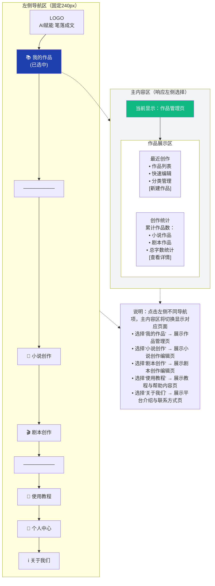

# JUGO（AI小说剧本创作平台）前端设计方案稿

[TOC]

 

## 设计总则

### 设计理念

轻量操作，重度赋能——前端布局简洁有序，核心功能一键可达，弱化技术门槛；同时将AI辅助、格式编辑、长文本管理等核心功能可视化、便捷化，减少创作干扰，聚焦内容本身；兼顾小说创作的流畅性与剧本创作的专业性，实现双场景无缝切换。突出“双场景适配、长文本友好、AI全流程赋能”的前端体验，适配10万+字长文本创作与剧本专业格式编辑，满足新手快速上手、专业用户高效创作的双重需求。

### 核心目标

- 新手适配：操作路径≤3步触达核心创作，引导式输入降低入门门槛；

- 效率提升：AI功能（续写、润色、转换、大纲生成）一键调用，长文本分章管理、上下文实时同步；

- 双场景适配：明确区分小说/剧本编辑模式，剧本模式支持专业格式（场景、角色、台词），小说模式支持长文本优化；

- 体验一致：多端同步（PC/平板/手机），交互逻辑统一，避免用户学习成本（参考蛙蛙多端适配特性）；

- 差异化突出：强化小说↔剧本双向转换可视化、雪花写作法引导、长文本审校提示，填补竞品前端空白。

### 目标用户

- 核心用户：网文新手、短剧创作者、兼职编剧（追求高效、简易操作）；

- 次要用户：专业编剧、长篇小说作者（需要专业格式、上下文管理）；

- 潜在用户：内容创业者、自媒体人（需要多场景内容生成、快速导出）。

## 核心设计规范（统一视觉与交互，贴合商业产品质感）

### 色彩规范（贴合创作氛围，简洁不刺眼）

- 主色调：墨蓝色（#1E40AF）—— 贴合文字创作的沉稳氛围，区别于竞品的亮色，提升专业感；

- 辅助色：
        
    - 功能色：绿色（#10B981，用于确认、生成、保存按钮）、橙色（#F59E0B，用于提示、引导、AI功能入口）、红色（#EF4444，用于删除、取消按钮）；

    - 中性色：白色（#FFFFFF，编辑区背景）、浅灰（#F3F4F6，页面背景）、中灰（#9CA3AF，辅助文字）、深灰（#1F2937，正文文字）；

- 色彩禁忌：避免高饱和对比色，编辑区背景与文字对比度≥4.5:1，保障长时间创作不疲劳。

### 字体规范（适配小说阅读与剧本编辑）

- 中文主字体：微软雅黑、思源黑体（无衬线字体，清晰易读，适配多设备）；

- 剧本专用字体：Courier New（等宽字体，符合剧本行业规范，角色名、台词对齐整齐）；

- 字体层级：
        

    - 页面标题：18-22px，加粗，深灰（#1F2937）；

    - 功能标题：16px，加粗，主色调（#1E40AF）；

    - 正文文字（小说）：14-16px，常规，深灰（#1F2937），行高1.8；

    - 剧本文字：12-14px，常规，深灰（#1F2937），行高1.6（等宽字体）；

    - 辅助文字：12px，常规，中灰（#9CA3AF）；

### 组件规范（统一交互，降低学习成本）

- 按钮：圆角4px，hover状态亮度提升10%，点击状态亮度降低10%；核心功能按钮（生成、导出）加大尺寸，置于显眼位置（参考笔灵AI核心功能突出设计）；

- 输入框：圆角4px，边框浅灰（#D1D5DB），focus状态边框主色调（#1E40AF），提示文字中灰（#9CA3AF）；

- 弹窗：圆角8px，阴影柔和（rgba(0,0,0,0.1)），标题加粗16px，内容区14px，底部按钮对齐右侧；

- 标签：圆角2px，背景浅灰（#F3F4F6），文字中灰（#9CA3AF），适配题材、风格等标签展示；

- 进度条：高度4px，背景浅灰（#D1D5DB），进度色主色调（#1E40AF），用于AI生成、导出等进度展示。

### 交互规范（流畅高效，反馈及时）

- 即时反馈：AI生成、保存、导出等操作，显示进度条+文字提示（如“生成中30%”“保存成功”），避免用户重复操作；

- 快捷操作：编辑区选中文字，右键唤起快捷菜单（续写、润色、删除、格式调整）；

- 无感知同步：创作过程中自动实时保存（每30秒一次），显示“自动保存中”提示，避免内容丢失；

- 场景切换：小说/剧本模式切换时，提示“格式将自动适配，不会丢失内容”，切换后保留编辑进度。

## 页面架构设计

### 页面交互说明

主内容区为动态响应区域，根据用户在左侧导航区的选择实时切换页面内容：
- 选择"我的作品" → 主内容区展示作品管理页
- 选择"小说创作" → 主内容区展示小说创作编辑页
- 选择"剧本创作" → 主内容区展示剧本创作编辑页
- 选择"使用教程" → 主内容区展示教程与帮助内容页
- 选择"关于我们" → 主内容区展示平台介绍与联系方式页

### 页面布局示意图

- 当用户选择"我的作品"时:

## 核心页面详细设计

### 作品管理页

参考 [JUGO前端作品管理页设计方案稿.md](JUGO前端作品管理页设计方案稿.md)

### 小说创作编辑页

参考 [JUGO前端小说创作编辑页设计方案稿.md](JUGO前端小说创作编辑页设计方案稿.md)

### 剧本创作编辑页

参考 [JUGO前端剧本创作编辑页设计方案稿.md](JUGO前端剧本创作编辑页设计方案稿.md)

### 教程与帮助内容页

参考 [JUGO前端教程与帮助内容页设计方案稿.md](JUGO前端教程与帮助内容页设计方案稿.md)

### 平台介绍与联系方式页

参考 [JUGO前端平台介绍与联系方式页设计方案稿.md](JUGO前端平台介绍与联系方式页设计方案稿.md)

## 响应式设计（适配多端）

核心原则：PC端侧重高效编辑、功能全面；平板端侧重便捷操作、双栏布局；手机端侧重简化操作、核心功能优先，确保多端交互逻辑统一、数据同步。

### PC端（核心场景，屏幕宽度≥1200px）

- 布局：三栏布局（左侧设置区+中间编辑区+右侧预览区），所有功能全部展示，编辑区最大化，适配长文本创作与专业剧本编辑；

- 特色：支持全屏编辑、多标签页编辑（同时打开多个作品）、快捷键操作（如Ctrl+S保存、Ctrl+Z撤销），提升专业用户效率。

### 平板端（屏幕宽度768px-1199px）

- 布局：双栏布局（编辑区+可切换设置/预览区），左侧设置区与右侧预览区可切换显示，不同时展示；

- 特色：支持手势操作（滑动切换章节、双指缩放字体），编辑区适配平板屏幕，按钮尺寸加大，便于触摸操作。

### 手机端（屏幕宽度≤767px）

- 布局：单栏布局，核心功能（编辑、保存、导出、AI续写）置顶，设置区、预览区通过底部标签切换，避免滚动过多；

- 特色：简化编辑区操作，隐藏次要功能，保留核心编辑工具；作品管理页采用列表式布局，便于滑动查找；支持离线编辑（缓存作品到本地，联网后自动同步）。

## 差异化前端设计（突出平台优势，规避竞品劣势）

- 双场景深度适配：区别于蛙蛙写作剧本功能薄弱、笔灵AI无专业剧本格式，前端明确区分小说/剧本模式，剧本模式支持行业标准格式，小说模式强化长文本管理，切换流畅无感知；

- 雪花写作法可视化：前端加入雪花写作法引导入口，分步引导用户完成“核心概括→大纲扩展→角色设定→正文创作”，贴合之前的适配需求，竞品无此前端设计；

- 长文本友好设计：编辑区支持滚动加载、分章管理、上下文实时同步，右侧预览区显示分章进度与问题提示，解决笔灵AI长文本管理不足的问题；

- AI功能可视化：AI生成、润色、转换等操作，显示实时进度与优化提示，选中文字可快速唤起AI快捷功能，比蛙蛙写作、笔灵AI的AI功能更便捷；

- 隐私与本地适配：前端支持本地缓存、离线编辑，同时提供云端同步选项，兼顾隐私保护与多端使用，参考开源工具隐私优势，弥补商业竞品不足。

## 兼容性设计（确保多环境可用，参考商业产品标准）

- 浏览器兼容性：支持Chrome（最新版本）、Edge（最新版本）、Firefox（最新版本）、Safari（最新版本），核心功能兼容，不支持IE浏览器（标注提示）；

- 系统兼容性：PC端支持Windows 10及以上、macOS 11及以上；平板端支持iPadOS 14及以上、Android平板系统10及以上；手机端支持iOS 14及以上、Android 10及以上；

- 性能兼容性：编辑区支持10万+字长文本编辑，无明显卡顿；AI生成进度条流畅，导出大文件（10万字以上）无崩溃；页面加载时间≤3秒，弱网环境下支持基础编辑功能。

## 前端开发建议（贴合设计方案，可落地）

- 技术选型：前端框架采用Vue3（高效、灵活，适配多端），UI组件库采用Element Plus（贴合设计规范，可自定义样式），富文本编辑器采用TinyMCE（支持自定义扩展，适配小说/剧本双格式）；

- 性能优化：长文本采用分段加载、懒加载，减少页面卡顿；AI功能采用异步请求，避免阻塞页面操作；图片、素材采用压缩处理，提升加载速度；

- 测试重点：重点测试创作页双模式切换、长文本编辑、AI功能调用、多端同步、导出功能，确保无异常；测试不同浏览器、系统的兼容性，修复显示与交互问题；

- 迭代建议：上线后收集用户反馈，重点优化新手引导、编辑区体验、AI功能响应速度，逐步完善前端功能，贴合用户创作习惯。

## 总结

本前端设计方案紧扣AI小说剧本双创作场景，兼顾新手友好性与专业实用性，核心突出“双场景适配、长文本友好、AI全流程赋能、差异化设计”四大亮点，规避了竞品前端劣势（剧本功能薄弱、长文本管理不足、新手引导不完善），同时结合之前的竞品分析、雪花写作法适配需求，形成了可落地、可迭代的前端设计方案。方案涵盖页面架构、交互逻辑、设计规范、多端适配等核心内容，贴合商业产品的前端体验，既能满足新手快速上手的需求，也能适配专业用户的高效创作，为AI小说剧本创作平台的前端开发提供清晰的指导，同时为后续功能迭代预留了扩展空间。
> （注：文档部分内容可能由 AI 生成）